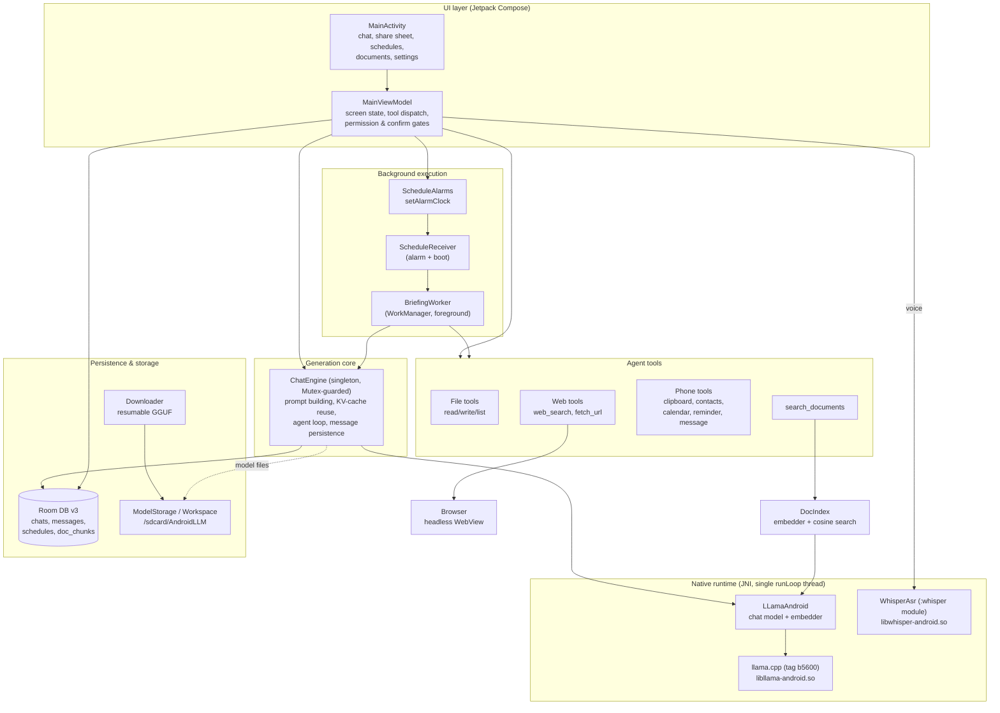
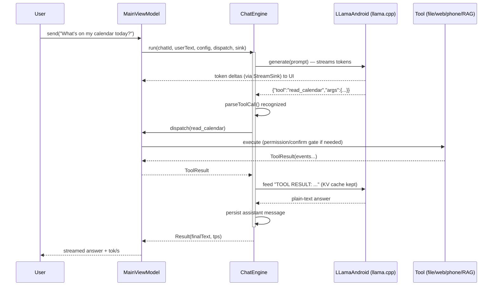
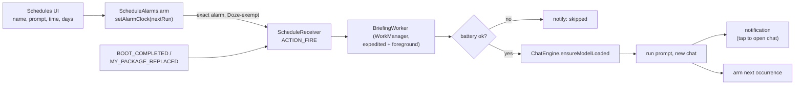
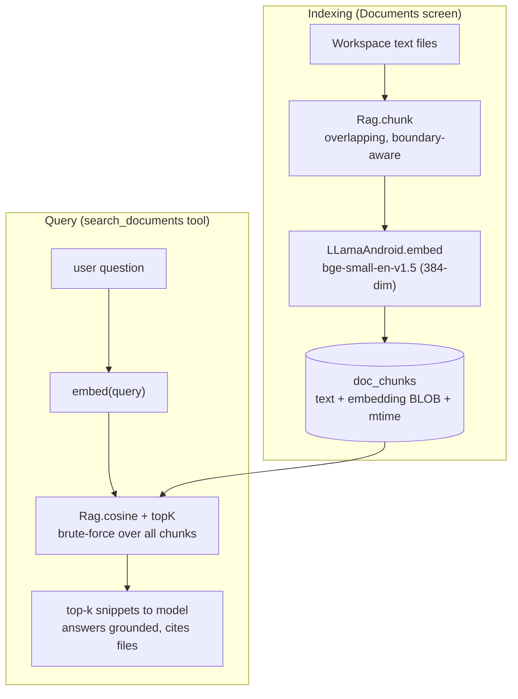
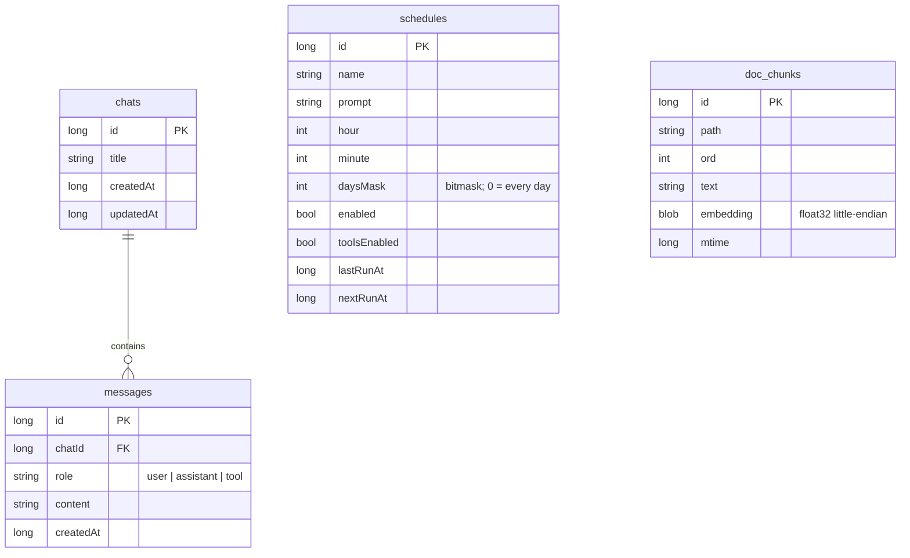

# AndroidLLM

**A fully on-device AI assistant for Android** — chat, agent tools, voice input, proactive
briefings, and retrieval over your own documents, all running locally on the phone with
**no cloud calls**.

The chat model is **Qwen3-4B (Q4_K_M)** running on [llama.cpp](https://github.com/ggml-org/llama.cpp);
embeddings use **bge-small-en-v1.5**; speech-to-text uses **Whisper (whisper.cpp)**. No model is
bundled in the APK — each is downloaded on demand and stored locally.

Built for and tested on a **OnePlus 13 (Snapdragon 8 Elite)**, where Qwen3-4B decodes at roughly
**25–30 tokens/sec** — comfortably above a 10 TPS target.

> Latest release: **v1.11.1** · APK bundles `arm64-v8a` (phones) + `x86_64` (emulator).

---

## Table of contents

- [Feature overview](#feature-overview)
- [System architecture](#system-architecture)
- [The agent tool-call loop](#the-agent-tool-call-loop)
- [Feature deep-dives](#feature-deep-dives)
  - [Agent tools](#1-agent-tools)
  - [Share-to-assistant](#2-share-to-assistant)
  - [Phone-native tools](#3-phone-native-tools)
  - [Scheduled prompts (proactive briefings)](#4-scheduled-prompts-proactive-briefings)
  - [Chat with your documents (on-device RAG)](#5-chat-with-your-documents-on-device-rag)
  - [Voice input](#6-voice-input-on-device-speech-to-text)
- [Data model](#data-model)
- [Threading & the native runtime](#threading--the-native-runtime)
- [Project layout](#project-layout)
- [Build & run](#build--run)
- [Configuration & tuning](#configuration--tuning)
- [Testing](#testing)
- [Credits & license](#credits--license)

---

## Feature overview

| Area | What it does |
|------|--------------|
| **On-device chat** | Streams Qwen3-4B replies token-by-token with a live tokens/sec readout. ChatML with a "fast mode" (pre-seeded empty `<think></think>`) for snappy answers. |
| **Chat management** | Room-persisted chats & messages, chat list, full-text search, KV-cache reuse across turns. |
| **Agent tools** | The model can call tools and act on the results: files, web, phone, and documents. |
| **Share-to-assistant** | System share-sheet + text-selection entry ("Ask AndroidLLM"): summarize/translate/reply to any text, URL, or file. |
| **Phone-native tools** | Read clipboard/contacts/calendar; create events, reminders, and SMS/email drafts (with confirmation). |
| **Scheduled prompts** | Run a saved prompt on a schedule (e.g. an 8am briefing) and deliver the result as a notification. |
| **Documents (RAG)** | Index your workspace files and ask questions grounded in them — fully offline semantic search. |
| **Voice input** | Dictate messages; transcribed on-device by Whisper. No Google speech services. |
| **Storage** | Model stored in `/sdcard/AndroidLLM` so it survives uninstall/reinstall; configurable workspace folder. |

Everything runs locally. The only network use is (a) downloading models on first use and
(b) the `web_search`/`fetch_url` tools when you explicitly use them.

---

## System architecture

The app is a single Compose `MainActivity` + `MainViewModel`, backed by a headless
**`ChatEngine`** that owns the native model session. Both the interactive UI and background
workers drive generation through the same engine.



**Key idea:** `ChatEngine` is a process-wide singleton guarded by a `Mutex`, so the foreground
chat and a background briefing never touch the single native context at the same time. Tools are
dispatched by the caller (UI or worker) via a `dispatch: (ToolCall) -> ToolResult` lambda, so the
same agent loop serves both — with the UI applying permission/confirmation gates that a headless
run declines.

---

## The agent tool-call loop

When **Tools** is on, the model may reply with a single JSON object to call a tool. The engine
runs it, feeds back a `TOOL RESULT:` turn (continuing from the KV cache), and loops until the
model answers in plain text — capped at 5 tool calls per message.



Tool routing (in `MainViewModel.dispatchTool` / `BriefingWorker.dispatchHeadless`):

- **File tools** → `Tools.execute` (synchronous, sandboxed to the workspace).
- **Web tools** → `Browser` (headless WebView, async on the main thread).
- **Phone tools** → `PhoneTools` behind runtime-permission and confirmation gates.
- **`search_documents`** → `DocIndex` (embed query, then cosine search over the vector store).

---

## Feature deep-dives

### 1. Agent tools

| Tool | Args | Purpose |
|------|------|---------|
| `read_file`  | `{"path","offset"=1,"limit"=200}` | Read a text file; large files paginate and report the next `offset` |
| `write_file` | `{"path","content"}` | Create/overwrite a text file |
| `list_files` | `{}` | List workspace files |
| `web_search` | `{"query"}` | Web search: titles, URLs, snippets |
| `fetch_url`  | `{"url","offset"=0}` | Open a page and read it as clean, paginated text |
| `read_clipboard` | `{}` | Read clipboard text |
| `find_contact` | `{"name"}` | Look up a contact |
| `read_calendar` | `{"start","end"/"days"=7}` | List upcoming events |
| `create_event` | `{"title","start","end"}` | Add a calendar event *(confirm)* |
| `create_reminder` | `{"text","time"}` | Schedule a reminder notification *(confirm)* |
| `compose_message` | `{"to","body","channel","subject"}` | Open a pre-filled SMS/email **draft** *(confirm)* |
| `search_documents` | `{"query","k"=4}` | Retrieve top-k snippets from your indexed files |

File tools are sandboxed to the workspace (`Workspace.resolvePath` rejects `..` and disallowed
absolute paths). Tool-following quality scales with model size — Qwen3-4B handles JSON tool calls
reliably; very small models may not.

**Web browsing (headless WebView).** `web_search`/`fetch_url` run a real browser engine
(JavaScript, normal user agent) and inject JS to extract content — a Readability-style extractor
for pages and result-node scraping for search — conceptually like `Runtime.evaluate` over the
Chrome DevTools protocol. This handles JS-heavy pages and no-JS bot walls that trip up raw HTTP.

### 2. Share-to-assistant

Manifest intent filters (`ACTION_SEND`, `ACTION_SEND_MULTIPLE`, `ACTION_PROCESS_TEXT`) put
"Ask AndroidLLM" in the system share sheet and the text-selection toolbar. `ShareRouting`
classifies the payload (text / URL / file) and a quick-action sheet (Summarize, Key points,
Translate, Reply draft, Ask…) opens a fresh chat with the result. URLs are summarized via
`fetch_url`; files are copied into the workspace and read via `read_file`.

### 3. Phone-native tools

`PhoneTools` lets the model act on the device through the tool loop. Reads (clipboard, contacts,
calendar) request the relevant runtime permission on first use; state-changing actions
(create event/reminder, compose message) require an explicit **confirmation dialog**, and
messages are **draft-only** (the user taps send). The agent loop suspends on a
`CompletableDeferred` until the user responds to a permission or confirmation prompt.

### 4. Scheduled prompts (proactive briefings)



`ScheduleTime.nextRun` computes the next fire time from an hour/minute + weekday bitmask. Alarms
use `setAlarmClock()` (Doze-exempt, resilient on aggressive OEM battery managers like OnePlus).
The worker runs as an expedited foreground service (`dataSync`), skips on low battery, writes the
result as a chat, posts a tap-to-open notification, and re-arms the next run. Alarms are
re-armed on reboot/app-update.

### 5. Chat with your documents (on-device RAG)



A small **bge-small-en-v1.5** GGUF (~34 MB) is downloaded on demand and loaded into a dedicated
embedding context (`new_embedding_context` + `embed` JNI, mean-pooled and L2-normalized). The
indexer chunks workspace text files, embeds them, and upserts vectors into a Room `doc_chunks`
table (skipping unchanged files by mtime). `search_documents` embeds the query and ranks chunks by
cosine similarity (brute force — fine at personal scale). OCR/PDF are planned; any UTF-8 text file
is indexed today.

### 6. Voice input (on-device speech-to-text)

Tap the mic to dictate. Audio is captured at 16 kHz mono and transcribed **on-device by Whisper**
(`whisper.cpp`) in a separate Gradle module **`:whisper`** with its own isolated native build — so
its bundled `ggml` doesn't collide with llama.cpp's `ggml` (two independent `.so` files). The
model (`ggml-base.bin`, ~142 MB) downloads on first use; requires `RECORD_AUDIO`.

---

## Data model



Room database `androidllm-chats.db` is at **version 3** with migrations `1->2` (schedules) and
`2->3` (doc_chunks) that preserve existing chats.

---

## Threading & the native runtime

All native calls are marshalled onto a **single dedicated `runLoop` thread** because a
`llama_context` is not thread-safe. `ChatEngine`'s `Mutex` additionally serializes whole
generations so the foreground chat and a background briefing can't interleave.

The chat model and the embedder are **two separate contexts** sharing the one `runLoop` and one
process-wide `LLamaAndroid` singleton. Model/embedder "loaded" state is tracked with
process-wide `@Volatile` flags (not thread-local), so background workers reading `llama.loaded`
off the runLoop thread get the correct value — this is what makes scheduled runs reliable.

---

## Project layout

```
app/src/main/cpp/
  CMakeLists.txt                 # fetches + builds llama.cpp (tag b5600)
  llama-android.cpp              # JNI bridge (chat + embeddings)
app/src/main/java/android/llama/cpp/
  LLamaAndroid.kt                # Kotlin bridge over JNI (chat model + embedder)
app/src/main/java/com/example/androidllm/
  MainActivity.kt                # Compose UI (chat, share, schedules, documents, settings)
  MainViewModel.kt               # screen state, tool dispatch, permission/confirm gates
  ChatEngine.kt                  # headless generation core (prompt, KV cache, agent loop)
  Agent.kt                       # Tools + RagTools descriptors, tool parsing/execution
  PhoneTools.kt                  # clipboard/contacts/calendar/reminder/message
  Browser.kt / WebTools.kt       # headless WebView search + fetch
  Share.kt                       # share-sheet routing
  DocIndex.kt / Rag.kt           # RAG: embedder, indexer, chunking, cosine search
  ScheduleAlarms.kt / ScheduleReceiver.kt   # scheduled-prompt alarms + boot re-arm
  BriefingWorker.kt              # WorkManager job that runs a schedule
  ScheduleTime.kt                # pure next-run computation
  ReminderReceiver.kt            # reminder notifications
  Downloader.kt                  # resumable GGUF downloader
  ModelStorage.kt / Settings.kt  # model + workspace storage
  AudioRecorder.kt               # 16 kHz mic capture
  data/                          # Room: ChatDatabase, DAOs, Entities
whisper/                         # :whisper module — isolated whisper.cpp native build
```

---

## Build & run

**Prerequisites:** Android Studio (Ladybug+), **SDK Platform 35**, **NDK** + **CMake**, JDK 17,
and an **arm64-v8a** device with ~3 GB free for the chat model. The Gradle wrapper is pinned to
**Gradle 8.9** / **AGP 8.5.2**.

### Android Studio (recommended)
1. `File -> Open` this folder and let Gradle sync (accept the NDK/CMake install prompt).
2. Plug in the phone (USB debugging on) and **Run**. The first build compiles llama.cpp from
   source (a few minutes).

### Command line
```powershell
# create local.properties: sdk.dir=C:\Users\<you>\AppData\Local\Android\Sdk
.\gradlew.bat :app:installDebug                     # universal (arm64 + x86_64)
.\gradlew.bat :app:assembleDebug -PtargetAbi=x86_64 # faster single-ABI build (emulator)
```

The output APK is named `AndroidLLM-v<version>-<buildType>.apk`.

### First run
1. Tap **Download & load model** (default `Qwen/Qwen3-4B-GGUF -> Qwen3-4B-Q4_K_M.gguf`, ~2.5 GB;
   resumable — use Wi-Fi). You can paste any GGUF URL.
2. Chat streams token-by-token; the top bar shows the last tok/s.
3. Toggle **Tools** for agent mode, **Fast mode** for snappy (non-thinking) replies.
4. Open **Documents** to index files, **Schedules** for briefings, and the share sheet from any app.

---

## Configuration & tuning

- **Context / batch size** = 2048 (`new_context` in `llama-android.cpp`, `new_batch` in
  `LLamaAndroid.kt`). Raise both together for longer chats (more RAM).
- **Threads** auto-set to `min(8, cores-2)`.
- **Sampler** is greedy/deterministic; extend `new_sampler` for temperature/top-p.
- **Swap models** via the setup screen or `DEFAULT_MODEL_URL` (any ChatML/Qwen3 GGUF works):

  | Model | Quant | Notes |
  |-------|-------|-------|
  | Qwen3-1.7B | Q4_K_M | Much faster, lighter |
  | **Qwen3-4B** | **Q4_K_M** | **Recommended (~25–30 TPS)** |
  | Qwen3-8B | Q4_K_M | Smarter, ~12–16 TPS, ~5 GB RAM |

- **On OnePlus/OxygenOS**, for on-time schedules also set the app's battery usage to
  **Unrestricted** and grant **Alarms & reminders** (the Schedules screen links to it).
- Bumping the llama.cpp `GIT_TAG` in `CMakeLists.txt` updates the engine; re-check that
  `llama-android.cpp` still matches that tag's C API.

---

## Testing

Host unit tests (pure logic — run with `.\gradlew.bat :app:testDebugUnitTest`):

- `RagTest` — chunking, cosine/topK ranking, vector blob round-trip.
- `ScheduleTimeTest` — next-run computation (rollover, weekday masks).
- `ShareRoutingTest` — share classification + prompt building.
- `PhoneToolsTest` — date/arg parsing, write-tool/permission gating.
- `WebToolsTest`, `WorkspaceResolveTest` — extraction logic, sandbox path resolution.

Instrumented tests (device/emulator): `BrowserInstrumentedTest`, plus a Whisper transcription
test in `:whisper`. Device-dependent code (WebView, model runtime) is validated with deterministic
instrumented tests rather than flaky UI automation.

---

## Credits & license

The JNI bridge (`llama-android.cpp`) and `LLamaAndroid` are adapted from the official
[llama.cpp Android example](https://github.com/ggml-org/llama.cpp/tree/master/examples/llama.android)
(tag `b5600`, MIT). Chat model **Qwen3-4B** (Qwen), embeddings **bge-small-en-v1.5** (BAAI),
speech-to-text **Whisper** (OpenAI) via **whisper.cpp**. Models are downloaded from Hugging Face at
runtime and are subject to their respective licenses.
