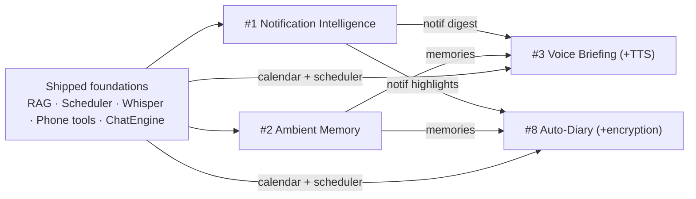

# AndroidLLM — Feature Build Plan (2026-07-02)

Detailed implementation plan for **four "killer" features** from
[`ideas/androidllm-killer-features-spec.md`](ideas/androidllm-killer-features-spec.md):

1. **Notification Intelligence & Triage**
2. **Ambient Memory ("Second Brain")**
3. **Voice Morning Briefing (Scheduled + TTS)**
8. **Auto-Diary / Continuous Journaling**

Everything below builds on the **already-shipped foundations** (v1.11.1): on-device Qwen3-4B via
`ChatEngine`, the JSON agent tool-loop (`Agent.kt`), RAG (`DocIndex`/`Rag`/`doc_chunks` + bge
embedder), scheduled prompts (`ScheduleAlarms`/`ScheduleReceiver`/`BriefingWorker`/`ScheduleTime`),
phone tools (`PhoneTools`: calendar/contacts/reminders), Whisper STT (`:whisper`), share-to-assistant
(`ShareRouting`), and Room (`ChatDatabase` v3).

---

## Build order & rationale

**#2 Ambient Memory → #1 Notification Intelligence → #3 Voice Briefing → #8 Auto-Diary**

Two features are *data producers* (#1, #2); two are *consumers/composition layers* (#3, #8) that
stitch the producers together. Build producers first (cheapest & most-reused first), consumers last.

| Order | Feature | Ships as | Effort | Risk | Main new tech |
|:-:|---|:-:|:-:|:-:|---|
| 1 | #2 Ambient Memory | v1.12.0 | M | Low | ML Kit OCR, capture tile, memory browser |
| 2 | #1 Notification Intelligence | v1.13.0 | M–L | Med | `NotificationListenerService`, GBNF JSON, smart-reply |
| 3 | #3 Voice Briefing | v1.14.0 | M | Med | Neural TTS (Piper) |
| 4 | #8 Auto-Diary | v1.15.0 | M | Med | Encrypted store (SQLCipher/Keystore) |

Release a new version after each, per the established workflow (build universal APK →
unit-test → commit → push → `gh release`).

---

## Cross-cutting foundations (do during #2 and #1)

These are called for by the spec and pay off across all four features — build them once.

### A. Grammar-constrained decoding (GBNF / JSON schema) — during #1
Small models are only reliable for classification/extraction when output is grammar-constrained.
- **Native:** llama.cpp supports GBNF via `llama_sampler_init_grammar`. Extend `new_sampler` in
  `app/src/main/cpp/llama-android.cpp` to optionally accept a GBNF string, and add a
  `LLamaAndroid.generateConstrained(prompt, grammar)` path (or a per-call sampler).
- **Kotlin:** a `Grammars` helper producing GBNF for our schemas (notification tag, SMS record).
- Add `ChatEngine.Config.grammar: String?` threaded into the sampler for a single structured turn.
- **Fallback:** if constrained decode fails/repeats, retry once, then bucket as `informational`/`unparsed`.

### B. Shared eval harness + golden datasets — start during #2
- `app/src/test/resources/golden/` holds labeled JSONL datasets (device-independent).
- Host unit tests score pure logic (retrieval recall@k, classification F1) against fixtures.
- A `:bench` gradle task (instrumented) reports prefill/decode tok/s + TTFT per model×device,
  appended to a tracked `BENCHMARKS.md`. (Lightweight v1; expand later.)

### C. `MemoryStore` abstraction — during #2
A typed layer over the RAG vector store so #2/#1/#8 all write/query "items" with metadata
(source, type, timestamp, attribution id) rather than raw chunks.

---

## Feature #2 — Ambient Memory ("Second Brain")  → v1.12.0

**Goal:** everything the user shares, dictates, or clips is auto-embedded and indexed; natural-language
recall "just works" with cited sources.

**Depends on:** existing RAG (`DocIndex`, `Rag`, `doc_chunks`, bge embedder), `ShareRouting`, Whisper.

### UX
- **Capture surfaces:**
  - Share sheet — extend existing `ShareRouting` with a **"Save to memory"** action (text/URL/image).
  - **Quick Settings tile** (`TileService`) for one-tap capture of clipboard/last-share.
  - Voice notes via the existing Whisper pipeline → transcript saved as a memory.
- **Recall:** a "Memories" screen + the `search_documents`-style tool, but over memories; answers
  show tappable **source chips** that open the original item.
- **Lifecycle:** memory browser with delete/pin; export to JSON/Markdown; full wipe.

### Architecture / components (new files)
- `data/MemoryEntity.kt` + `MemoryDao.kt` — table `memories(id, type, sourceApp, uri, title, text,
  createdAt, pinned)`; chunks reuse `doc_chunks` with a `memoryId` FK (or a parallel `memory_chunks`).
- `MemoryStore.kt` — capture(text|uri|image) → normalize → chunk (`Rag.chunk`) → embed
  (`LLamaAndroid.embed`) → upsert; and `recall(query, k)` (hybrid, see below).
- `Ocr.kt` — ML Kit on-device Text Recognition (`com.google.mlkit:text-recognition`) for images.
- `capture/CaptureTileService.kt` — Quick Settings tile.
- `RagTools`: add `search_memory` (or reuse `search_documents` scoped to memories).
- UI: `MemoriesScreen.kt` (browser + search), a new top-bar/drawer entry.

### Data model
- Room `ChatDatabase` **v3 → v4** migration: add `memories` (+ `memory_chunks` or a `source`/`memoryId`
  column on `doc_chunks`).

### Retrieval upgrade (hybrid BM25 + vector)
- Add a lightweight lexical score (SQLite `FTS4` over memory text or a pure-Kotlin BM25) and merge
  with cosine (reciprocal-rank fusion). Pure ranking logic → host-testable in `Rag`.

### Dependencies
- `com.google.mlkit:text-recognition:16.x` (bundled, on-device, no network).

### Testing
- Host: chunking already tested; add hybrid-fusion ranking tests; capture-normalization (URL→text
  via existing `fetch_url`, image→OCR) with fixtures.
- Golden retrieval set (≥ 50 query→memory pairs incl. 10 not-in-memory) → recall@5 + false-answer rate.
- Instrumented: OCR a bundled image; ingest → kill app → reopen → query still hits (durability).

**DoD (subset):** recall@5 ≥ 0.85 on the golden set; not-in-memory queries answer "nothing found"
≥ 90%; every answer shows source chips; export + wipe verified (wipe leaves zero vectors).

**Effort:** M · **Risk:** Low (mostly UX + OCR over existing RAG).

---

## Feature #1 — Notification Intelligence & Triage  → v1.13.0

**Goal:** read the notification stream, classify/triage, and produce on-demand or scheduled digests
("what did I miss?"); optionally draft smart replies.

**Depends on:** `ChatEngine`, scheduled prompts (for scheduled digests), GBNF (cross-cutting A),
`MemoryStore` (optional, to fold highlights into memory).

### UX
- One-time **Notification Access** grant flow (system settings) with a clear disclosure screen.
- "Summarize notifications since <time>" → 3-line digest grouped by importance, each line
  deep-linking back to the source notification.
- Silent-hours breakthrough: only `urgent` items alert.
- Smart reply: 2–3 draft replies for messaging notifications exposing `RemoteInput`.

### Architecture / components (new files)
- `notif/NotificationListener.kt` — `NotificationListenerService`; captures title/text/subText/
  package/timestamp + `MessagingStyle` conversation; stores in Room with rolling retention (72 h).
- `data/NotificationEntity.kt` + `NotificationDao.kt` — table `notifications(id, pkg, title, text,
  category, tags, postedAt, keyDeepLink)`.
- `notif/NotificationClassifier.kt` — batched (every ~15 min or on digest request) prompt →
  **GBNF-constrained JSON** `{tag: urgent|actionable|informational|noise, sender, deadline, amount}`.
- `notif/DigestBuilder.kt` — groups by category, **forces source-id attribution** (post-check verifies
  every digest sentence maps to ≥ 1 notification id).
- Smart reply: fire the notification's own `RemoteInput` via `RemoteInput.addResultsToIntent()` +
  `actionIntent.send()` (no per-app integration).
- Integrations: a `get_notifications`/`summarize_notifications` agent tool; a "Notifications" screen;
  a scheduled-digest option in the existing Schedules UI.

### Data model
- `ChatDatabase` **v4 → v5** migration: add `notifications` table + retention cleanup query.

### Reliability (OnePlus/OxygenOS is the target aggressive-OEM case)
- Keep the listener alive via a lightweight foreground service + user guidance to set battery to
  Unrestricted (reuse the pattern/UI from the scheduled-prompts fix). Batch inference to protect battery.

### Testing
- Golden set: ≥ 200 labeled notifications (`urgent/actionable/informational/noise`) across apps/langs
  → macro-F1 + `urgent` recall; **schema-valid JSON ≥ 99.5%** (grammar).
- Digest attribution test: 0 unattributed claims across the digest suite.
- Instrumented: `RemoteInput` smart-reply send path on ≥ 1 messenger; listener survives Doze
  (`adb shell dumpsys deviceidle force-idle`).

**DoD (subset):** `urgent` recall ≥ 0.90, noise precision ≥ 0.85; schema-valid ≥ 99.5%; digest zero
unattributed claims; listener alive ≥ 99% over a 24 h soak on OnePlus 13 (default battery).

**Effort:** M–L · **Risk:** Med (listener survival on OEMs; Play disclosure if published).

---

## Feature #3 — Voice Morning Briefing (Scheduled + TTS)  → v1.14.0

**Goal:** a fully offline daily audio briefing (calendar + reminders + notification digest + memories),
generated by the SLM and spoken aloud — the "airplane-mode demo."

**Depends on:** scheduled prompts (`ScheduleAlarms`/`BriefingWorker`/`ScheduleTime`), `PhoneTools`
(`read_calendar`), **#1** (notification digest), **#2** (memories, optional), Whisper (ad-hoc "brief me").

### UX
- A **Briefing schedule** (special schedule type) at a chosen time; also a home-screen **widget** and
  an "brief me" voice/Assistant shortcut for ad-hoc runs.
- Script style: conversational, < 150 words, most-important item first.

### Architecture / components (new files)
- Reuse the scheduling stack; add a `ScheduleEntity.kind` (`PROMPT` | `BRIEFING`) or a dedicated
  `BriefingWorker` path that composes: calendar (next 24 h) + reminders due + notification digest
  (#1) + any cached weather → SLM script.
- **Pre-generate** the script the night before (charging window) and only **synthesize** at alarm time
  so audio starts ≤ 3 s after the alarm (Doze-safe).
- `tts/Tts.kt` — abstraction with two backends:
  - **v1:** Android `TextToSpeech` (zero-cost, ships immediately).
  - **v2:** bundled **Piper** neural TTS via JNI in a new isolated module `:piper` (mirrors the
    `:whisper` module pattern to avoid native symbol collisions); model ~50–300 MB downloaded on demand.
- Audio routing via `AudioAttributes.USAGE_ASSISTANT`; respect DND + audio focus (duck/pause for calls).
- `widget/BriefingWidget.kt` (`AppWidgetProvider`).

### New module (optional v2)
- `:piper` Gradle module with its own CMake build (same isolation approach as `:whisper`).

### Testing
- Factual harness: 50 synthetic days (known calendar/reminders/notifications) → script mentions 100%
  of critical items, invents nothing (attribution check).
- Length discipline: 95% of scripts within 90–170 words (host test on the composer output).
- Reliability: alarm fires within ±60 s across Doze/reboot/OEM battery (reuse scheduled-prompts test rig).
- TTS smoke tests by ear for numbers/dates/currencies/names.

**DoD (subset):** 30-day sim fires within ±60 s ≥ 99% incl. after reboot; zero invented items on the
factual harness; audio begins ≤ 3 s post-alarm; full run passes in airplane mode; respects DND/audio focus.

**Effort:** M · **Risk:** Med (bundling/qualifying Piper; Doze timing).

---

## Feature #8 — Auto-Diary / Continuous Journaling  → v1.15.0

**Goal:** a nightly on-device job composes a private daily log from the day's "exhaust" (calendar,
memories, notification highlights) into an encrypted, searchable archive.

**Depends on:** everything above — scheduler, `PhoneTools` (calendar), **#2** (memories), **#1**
(notification highlights), plus a new **encrypted store**. Pure composition layer.

### UX
- Nightly entry (e.g. 11 PM) in a user-chosen voice (neutral log / warm journal / bullet ops-review).
- Narrative recall over the diary ("what was I doing the week before X?").
- Weekly/monthly auto-retrospectives.
- Each source individually toggleable; entry regeneration when a source item is deleted.

### Architecture / components (new files)
- `diary/DiaryWorker.kt` — nightly `WorkManager` job (`requiresCharging + requiresDeviceIdle`);
  assembles the day's structured facts (each with an attribution id) → SLM writes the entry →
  store facts + prose (prose regenerable).
- `data/DiaryEntity.kt` + `DiaryDao.kt` — table `diary_entries(date, voice, facts_json, prose, ...)`;
  indexed into RAG **inside the encrypted store** for longitudinal recall.
- **Encrypted store:** SQLCipher (or Jetpack Security `EncryptedFile` for prose) keyed via Android
  Keystore + optional biometric unlock; diary excluded from `android:allowBackup`.
- Sources reuse existing readers (`PhoneTools` calendar, `MemoryStore`, `NotificationDao`).
- UI: `DiaryScreen.kt` (timeline + search + per-source toggles + voice preset).

### Data model
- New encrypted DB (separate from `androidllm-chats.db`) for diary + its vectors.

### Testing
- Factuality harness: 60 synthetic days → every entry statement traces to a source fact; zero invented
  people/places/commitments; missing-data days → graceful short entry, never filler.
- Style regression: < 30% 5-gram overlap between consecutive entries per voice (n-gram test).
- Longitudinal retrieval: 180 synthetic days → date-range recall ≥ 0.85 on a 50-query set.
- Security: DB pulled via adb is unreadable; biometric gate; backup-exclusion audited.

**DoD (subset):** zero unattributed claims (60-day harness); phrase-diversity gate met; DB encrypted at
rest (verified); each source toggle independently verified; nightly success ≥ 95% over a 30-day soak
with catch-up for missed nights.

**Effort:** M · **Risk:** Med (encryption correctness; compounding factuality bar).

---

## Suggested roadmap

1. **Cross-cutting B/C** (eval harness scaffold + `MemoryStore`) — small, unblocks the rest.
2. **#2 Ambient Memory** → v1.12.0 (extends RAG; OCR; capture surfaces).
3. **Cross-cutting A** (GBNF constrained decoding) + **#1 Notification Intelligence** → v1.13.0.
4. **#3 Voice Briefing** → v1.14.0 (TextToSpeech v1; Piper `:piper` module as v2).
5. **#8 Auto-Diary** → v1.15.0 (encrypted store; composition over #1/#2/calendar).

Each release: universal APK (`arm64-v8a` + `x86_64`), host unit tests + golden-set gates, emulator
smoke test, commit, push, `gh release`. On OnePlus, verify listener/alarm/worker survival with battery
optimization at its **default** (not "unrestricted").
